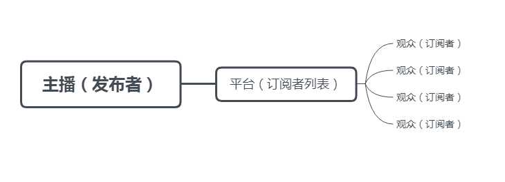

# 发布订阅模式
**发布 - 订阅模式**（Publish-Subscribe Pattern, pub-sub）又称为观察者模式（observer Parrern），它定义了一种一对多的关系，让多个订阅者对象同时监听某一个发布者，当发布者状态更改时，就会通知所有订阅自己的订阅者对象，使它们自动更新自己。


比如在现实生活中，当我们在直播平台关注了某一位主播时，就相当于我们订阅了他，每当该主播开始直播时，平台就会通知所有的订阅者，该主播开始直播了快来围观吧。如下图：


明白了上面的基本概念就很容易进行实现了。如下：
```js
    const anchor = {
        platform: [],
        follow(audience) {
            this.platform.push(audience)
        },
        notice() {
            this.platform.forEach(audience => audience.messageList())
        }
    }

    const audience1 = {
        name: '小明',
        messageList() {
            console.log(`亲爱的${this.name}，您关注的主播开启了直播！`)
        }
    }

    const audience2 = {
        name: '小花',
        messageList() {
            console.log(`亲爱的${this.name}，您关注的主播开启了直播！`)
        }
    }

    anchor.follow(audience1)
    anchor.follow(audience2)

    anchor.notice()

    // 输出
    // 亲爱的小明，您关注的主播开启了直播！
    // 亲爱的小花，您关注的主播开启了直播！
```

上面简单实现了一个简单的**发布-订阅**。现在我们进行进一步的完善，当我们关注一名主播时，不仅可以只关注同一个主播，也可以关注多个主播，同时也可以取消对某一位主播的关注。如下：
```js
    const anchor = {
        platform: {},
        follow(type, audience) {
            if(this.platform[type]) {
                // 去重
                !this.platform[type].includes(audience) && this.platform[type].push(audience)
            }else {
                this.platform[type] = [audience]
            }
        },
        // 取消关注
        unfollow(type, audience) {
            const index = this.platform[type].indexOf(audience)

            index !== -1 && this.platform[type].splice(index, 1)
        },
        notice(type) {
            this.platform[type] && this.platform[type].forEach(audience => audience.messageList(type))
        }
    }

    const audience1 = {
        name: '小明',
        messageList(type) {
            console.log(`亲爱的${this.name}，您关注的${type}主播开启了直播！`)
        }
    }

    const audience2 = {
        name: '小花',
        messageList(type) {
            console.log(`亲爱的${this.name}，您关注的${type}主播开启了直播！`)
        }
    }

    anchor.follow("a", audience1)
    anchor.follow("a", audience2)
    anchor.follow("b", audience2)

    anchor.notice("a")
    // 输出
    // 亲爱的小明，您关注的a主播开启了直播！
    // 亲爱的小花，您关注的a主播开启了直播！
    
    anchor.unfollow("a", audience2)
    anchor.notice("a")
    // 输出
    // 亲爱的小明，您关注的a主播开启了直播！
```

这样我们就可以不单单只关注某一位主播，还可以关注多位主播，并且可以取消关注了。

> 通过上面的例子我们可以看出**发布-订阅**最大的优点就是**解耦**：
> 1. 时间上的解耦 ：注册的订阅行为由消息的发布方来决定何时调用，订阅者不用持续关注，当消息发生时发布者会负责通知；
> 2. 对象上的解耦 ：发布者不用提前知道消息的接受者是谁，发布者只需要遍历处理所有订阅该消息类型的订阅者发送消息即可（迭代器模式），由此解耦了发布者和订阅者之间的联系，互不持有，都依赖于抽象，不再依赖于具体；
>
> 由于它的解耦特性，发布 - 订阅模式的使用场景一般是：当一个对象的改变需要同时改变其它对象，并且它不知道具体有多少对象需要改变
> 
> 发布 - 订阅模式也有缺点：
> 1. 增加消耗 ：创建结构和缓存订阅者这两个过程需要消耗计算和内存资源，即使订阅后始终没有触发，订阅者也会始终存在于内存；
> 2. 增加复杂度 ：订阅者被缓存在一起，如果多个订阅者和发布者层层嵌套，那么程序将变得难以追踪和调试，参考一下 Vue 调试的时候你点开原型链时看到的那堆 deps/subs/watchers 们…
>
> 缺点主要在于理解成本、运行效率、资源消耗，特别是在多级发布 - 订阅时，情况会变得更复杂。

!> 发布-订阅模式和观察者模式是存在一些细微的区别的，这里就不在介绍了。
<!-- > 发布 - 订阅模式和观察者模式的区别：
>
> 观察者模式 中的观察者和被观察者之间还存在耦合，被观察者还是知道观察者的；
>
> 发布 - 订阅模式 中的发布者和订阅者不需要知道对方的存在，他们通过消息代理来进行通信，解耦更加彻底； -->